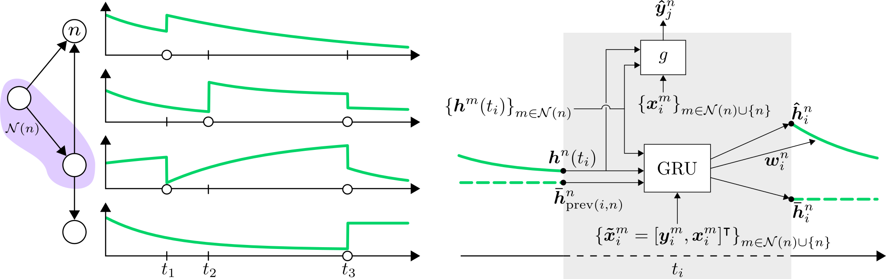

# Note: Extended Research
Our paper [Temporal Graph Neural Networks for Irregular Data](https://arxiv.org/abs/2302.08415) presents a substantial extension of the research associated with this repository. Please also take a look at the [code repository](https://github.com/joeloskarsson/tgnn4i) for that paper.   

# Temporal Graph Neural Networks with Time-Continuous Latent States
<p align="middle">
  
</p>

This repository contains the code for our paper [*Temporal Graph Neural Networks with Time-Continuous Latent States*](https://drive.google.com/file/d/1vQW0UUXXgOExSkEUmpHSgbKQXf-66yns/view?usp=sharing), from the workshop [*Continuous Time Methods for Machine Learning*](https://sites.google.com/view/continuous-time-methods-icml/home) at ICML 2022.

If you find our work useful, please cite:
```
@inproceedings{temporal_continuous_gnns,
    author = {Oskarsson, Joel and Sid{\'e}n, Per and Lindsten, Fredrik},
    title = {Temporal Graph Neural Networks with Time-Continuous Latent States},
    booktitle = {ICML Workshop on Continuous Time Methods for Machine Learning},
    year = {2022}
}
```

## Installation
Use python 3.9. Note that installation order is important.

1. Install required packages with `pip intall -r requirements.txt`
2. Install PyTorch Geometric (version 2.0.4). With `CUDA` set to one of (`cu102`, `cu113`, `cu115`, `cpu`), run:
```
pip install torch-scatter torch-sparse -f https://data.pyg.org/whl/torch-1.11.0+$CUDA.html
pip install torch-geometric==2.0.4
```
For more information see the [PyTorch Geometric documentation](https://pytorch-geometric.readthedocs.io/en/latest/notes/installation.html).

3. Install PyTorch Geometric Temporal with `pip install torch-geometric-temporal==0.51.0`.

## Data and pre-processing
To pre-process the datasets used in the experiments simply run the script `traffic_preprocessing.sh`.
The datasets are loaded directly through the [PyTorch Geometric Temporal](https://pytorch-geometric-temporal.readthedocs.io/en/latest/) library.

## Running the code
Training and evaluating the models can be done using `main.py`. Run `python main.py --help` for a list of options.
You can also specify all options in a json-file and call the script as `python main.py --config config.json`.
The most important flags are `--model`, for specifying the model to train, and `--dataset`, for specifying the dataset to use.
The dataset names correspond to the names of the sub-directories in the `dataset` directory (created when running pre-processing).

### W&B
The project is fully integrated with [Weights & Biases](https://www.wandb.ai/) (W&B) for logging and visualization, but can just as easily be used without it.
When W&B is used, training configuration, training/test statistics and plots are sent to the W&B servers and made available in an interactive web interface.
If W&B is turned off, logging instead saves everything locally to a directory like `wandb/dryrun...`.
Information like evaluation metrics and loss values are also written directly to standard output.
The W&B project name is set to `irregular-tgnns`, but this can be changed in `constants.py`.
See the [W&B documentation](https://docs.wandb.ai/) for details.

If you would like to login and use W&B, run:
```
wandb login
```
If you would like to turn off W&B and just log things locally, run:
```
wandb off
```

### Model names
The model names in the code (in particular used for the `--model` flag) do not completely match those in the paper.
They map in the following way:

* *GRU-D-Joint* in the paper = `gru` in code
* *GRU-D-Node* in the paper = `gru_node` in code
* *GRU-D-Graph* in the paper = `gru_graph` in code
* The *Predict Prev.* baseline can be used by running the `run_baselines.sh` script. See also `baselines.py`.

## Experiments
Descriptions of exact parameters for all experiments in yaml-format can be found in the `sweeps` directory.
If you are using W&B these files can be used directly to set up [sweeps](https://docs.wandb.ai/guides/sweeps/quickstart) to run each experiment.

* Sweep files named `traffic_hypertune_...` describe the hyperparameter tuning done on the 25% versions of each dataset. The best hyperparameters (in terms of RMSE) from this tuning were then used for the main experiment.
* Sweep files named `traffic_test_...` describe the main experiment from the paper (results in Figure 2). These runs also include training all models without the decay, but this was moved from Figure 2 to the ablation study in the paper.
* Sweep files named `ablation_...` are additional experiments done for the ablation study.

## Questions and contact Information
If you have any questions about the code please open a github issue.

